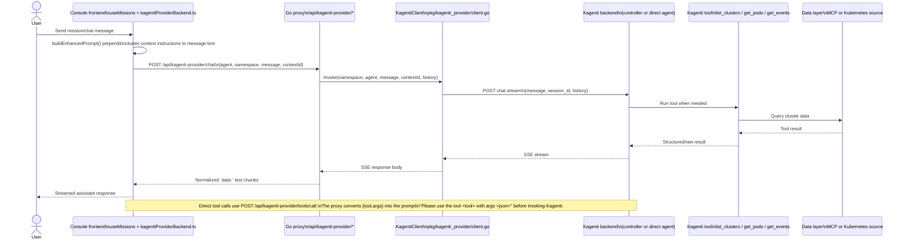

# Kagenti Tool Integration and Cluster Context Injection

This page documents the Kagenti integration as it exists in the current codebase.

> **IMPORTANT**: Before reading this technical integration guide, ensure you have Kagenti deployed correctly. See the [Kagenti Deployment Guide](../kagenti-deployment-guide.md) for setup instructions. Deploying only the `kagenti-backend` controller is not sufficient — you must also deploy at least one Kagenti agent.

## Scope

The Console has two Kagenti-facing paths:

1. **Chat streaming** via `POST /api/kagenti-provider/chat`
2. **Direct tool prompting** via `POST /api/kagenti-provider/tools/call`

The Go-side HTTP proxy is registered in `pkg/api/server.go`, implemented in `pkg/api/handlers/kagenti_provider_proxy.go`, and backed by `pkg/kagenti_provider/client.go`. The internal AI-provider adapter lives in `pkg/agent/provider_kagenti.go`; it uses the same `KagentiClient` for server-side provider flows, but the browser-facing Kagenti integration goes through the Fiber handler. The frontend entry points are `web/src/lib/kagentiProviderBackend.ts` and the mission flow in `web/src/hooks/useMissions.tsx` / `useMissions.provider.tsx`.

## Architecture



## API surfaces

| Route | Purpose |
| --- | --- |
| `GET /api/kagenti-provider/status` | Checks whether Kagenti is reachable and whether config management is available. |
| `GET /api/kagenti-provider/agents` | Returns discovered agents from the controller or direct agent endpoint. |
| `PATCH /api/kagenti-provider/config` | Updates in-cluster Kagenti LLM provider configuration. |
| `POST /api/kagenti-provider/chat` | Streams chat through Kagenti over SSE. |
| `POST /api/kagenti-provider/tools/call` | Asks Kagenti to invoke a named tool with JSON args. |

## Built-in tools visible in this repo

The requested names `get_cluster_list` and `get_pod_list` do **not** exist in the current codebase. The actual tool names used by KubeStellar code are:

| Tool name | Where it appears | Notes |
| --- | --- | --- |
| `list_clusters` | `pkg/api/handlers/mcp_resources.go`, `pkg/mcp/bridge.go` | Read-only cluster discovery tool. |
| `get_pods` | `pkg/api/handlers/mcp_resources.go`, `pkg/mcp/bridge.go`, UI drill-down mapping | Read-only pod listing tool. |
| `get_events` | `pkg/api/handlers/mcp_resources.go`, `pkg/mcp/bridge.go`, UI drill-down mapping | Read-only event listing tool. |

These are KubeStellar/MCP tool names. Kagenti can use them only if the selected Kagenti agent exposes matching tools upstream.

## Message and context payloads

### 1. Frontend request sent to the Go proxy

`web/src/lib/kagentiProviderBackend.ts` sends:

```json
{
  "agent": "<agent-name>",
  "namespace": "<namespace>",
  "message": "<enhanced prompt>",
  "contextId": "<mission-or-session-id>"
}
```

### 2. Context block injected into the message text

Cluster context is currently injected as a **plain-text prompt prelude**, not as a structured JSON object.

Single-cluster form from `buildEnhancedPrompt()`:

```text
Target cluster: <cluster>
IMPORTANT: All kubectl commands MUST use --context=<cluster>

<original user prompt>
```

Multi-cluster form:

```text
Target clusters: <cluster-a>, <cluster-b>
IMPORTANT: Perform the following on EACH cluster using its respective kubectl context:
  1. Cluster "<cluster-a>": use --context=<cluster-a>
  2. Cluster "<cluster-b>": use --context=<cluster-b>

<original user prompt>
```

Optional dry-run guidance is appended for dry-run missions, and install/deploy missions also append a non-interactive-terminal warning.

### 3. Upstream payload sent from the Go proxy to Kagenti

`pkg/kagenti_provider/client.go` sends:

```json
{
  "message": "<enhanced prompt>",
  "session_id": "<contextId>",
  "history": [
    { "role": "user", "content": "..." },
    { "role": "assistant", "content": "..." }
  ]
}
```

For direct-agent mode the shape is the same, except the payload uses the same fields against the direct streaming endpoint.

## Streaming behavior

The Go proxy normalizes several SSE chunk shapes into plain text before returning them to the frontend. It extracts text from:

- `{ "type": "text", "text": "..." }`
- `{ "content": "..." }`
- `{ "delta": { "text": "..." } }`

Unknown chunk shapes are passed through as raw text.

## Direct tool call flow

`POST /api/kagenti-provider/tools/call` accepts:

```json
{
  "agent": "<agent-name>",
  "namespace": "<namespace>",
  "tool": "get_events",
  "args": {
    "cluster": "kind-dev",
    "namespace": "default"
  }
}
```

The handler does **not** call a local tool implementation directly. Instead, it serializes `args` and sends Kagenti this prompt:

```text
Please use the tool get_events with args {"cluster":"kind-dev","namespace":"default"}
```

The returned HTTP response is:

```json
{
  "tool": "get_events",
  "result": "<raw agent response body>"
}
```

## Adding a custom tool

There are two different extension points.

### A. Expose a tool that Kagenti already knows about

If the upstream Kagenti agent already registers `my_tool`, the Console proxy usually needs no new route. Call the existing endpoint from the frontend:

```ts
import { kagentiProviderCallTool } from '@/lib/kagentiProviderBackend'

await kagentiProviderCallTool('ops-agent', 'default', 'my_tool', {
  cluster: 'kind-dev',
  namespace: 'default',
})
```

Because the proxy forwards an arbitrary tool name plus args, success depends on the Kagenti backend actually exposing that tool.

### B. Add a new KubeStellar-backed read-only tool

If you are extending the KubeStellar MCP/data layer itself, follow the existing pattern used by `list_clusters`, `get_pods`, and `get_events`.

1. **Whitelist the tool** in `pkg/api/handlers/mcp_resources.go`:

```go
var AllowedOpsTools = map[string]bool{
    "list_clusters": true,
    "get_pods":      true,
    "get_events":    true,
    "get_namespaces": true,
}
```

2. **Add a typed bridge helper** in `pkg/mcp/bridge.go` if the rest of the backend needs a first-class wrapper:

```go
func (b *Bridge) GetNamespaces(ctx context.Context, cluster string) ([]NamespaceInfo, error) {
    b.mu.RLock()
    client := b.opsClient
    b.mu.RUnlock()

    if client == nil {
        return nil, fmt.Errorf("ops client not available")
    }

    args := map[string]interface{}{}
    if cluster != "" {
        args["cluster"] = cluster
    }

    result, err := client.CallTool(ctx, "get_namespaces", args)
    if err != nil {
        return nil, err
    }

    return b.parseNamespacesResult(result)
}
```

3. **Make sure the upstream Kagenti agent/tool server exposes the same tool name** if you want Kagenti to invoke it through `/api/kagenti-provider/tools/call`.

## Limitations

- **No structured context object is forwarded by `provider_kagenti.go`**. Cluster targeting is injected into the prompt text by the frontend, not sent via `ChatRequest.Context`.
- **Tool names are not validated by the Kagenti proxy**. `/api/kagenti-provider/tools/call` forwards any requested tool name to the upstream agent.
- **Direct tool calls are prompt-based**. The handler asks the agent to use a tool via plain text instead of calling a strongly typed RPC method.
- **Tool-call results are text-first**. The proxy returns `{tool, result}` where `result` is the raw agent response body string.
- **History is supported, but only on the chat path**. The direct tool-call path does not send prior history.
- **Response size is capped** on the tool-call path to avoid unbounded reads.
- **Availability depends on deployment mode**. The client supports controller mode and direct-agent mode, with different discovery and stream URLs.
