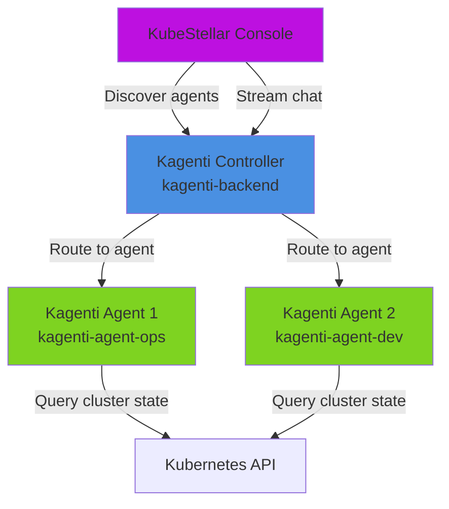

# Kagenti Deployment Guide

This guide explains how to deploy and configure Kagenti for use with the KubeStellar Console.

## Overview

The KubeStellar Console supports two Kagenti deployment modes:

1. **Controller Mode** (recommended) — A Kagenti controller manages multiple agent instances
2. **Direct Agent Mode** — The console connects directly to a single Kagenti agent service

**IMPORTANT**: Deploying only the `kagenti-backend` controller is not sufficient. You must also deploy at least one Kagenti agent that registers with the controller, or configure a direct agent URL. Without a registered agent, missions will fail with "Kagenti Agent Not Selected" or connection errors.

## Architecture



## Controller Mode Setup

### Prerequisites

- Kubernetes cluster with the KubeStellar Console deployed
- Helm 3+ or kubectl
- An LLM provider API key (Claude, OpenAI, or Gemini)

### Step 1: Deploy Kagenti Controller

Create a namespace for Kagenti:

```bash
kubectl create namespace kagenti-system
```

Create a secret with your LLM provider credentials:

```bash
# For Claude (recommended)
kubectl create secret generic kagenti-llm-secrets \
  --from-literal=CLAUDE_API_KEY=sk-ant-api03-... \
  --from-literal=DEFAULT_LLM_PROVIDER=claude \
  --namespace kagenti-system

# For OpenAI
kubectl create secret generic kagenti-llm-secrets \
  --from-literal=OPENAI_API_KEY=sk-proj-... \
  --from-literal=DEFAULT_LLM_PROVIDER=openai \
  --namespace kagenti-system

# For Gemini
kubectl create secret generic kagenti-llm-secrets \
  --from-literal=GEMINI_API_KEY=AIza... \
  --from-literal=DEFAULT_LLM_PROVIDER=gemini \
  --namespace kagenti-system
```

Deploy the Kagenti controller:

```bash
kubectl apply -f - <<EOF
apiVersion: v1
kind: Service
metadata:
  name: kagenti-backend
  namespace: kagenti-system
spec:
  selector:
    app: kagenti-backend
  ports:
    - port: 8000
      targetPort: 8000
      protocol: TCP
  type: ClusterIP
---
apiVersion: apps/v1
kind: Deployment
metadata:
  name: kagenti-backend
  namespace: kagenti-system
spec:
  replicas: 1
  selector:
    matchLabels:
      app: kagenti-backend
  template:
    metadata:
      labels:
        app: kagenti-backend
    spec:
      containers:
        - name: controller
          image: ghcr.io/kagenti/kagenti-controller:latest
          ports:
            - containerPort: 8000
          envFrom:
            - secretRef:
                name: kagenti-llm-secrets
          env:
            - name: KAGENTI_MODE
              value: "controller"
            - name: AGENT_DISCOVERY_ENABLED
              value: "true"
          resources:
            limits:
              cpu: 500m
              memory: 512Mi
            requests:
              cpu: 100m
              memory: 128Mi
EOF
```

### Step 2: Deploy at Least One Kagenti Agent

**This step is mandatory.** The controller cannot serve chat requests without registered agents.

Deploy a Kagenti agent that will register with the controller:

```bash
kubectl apply -f - <<EOF
apiVersion: v1
kind: Service
metadata:
  name: kagenti-agent-ops
  namespace: kagenti-system
spec:
  selector:
    app: kagenti-agent-ops
  ports:
    - port: 8001
      targetPort: 8001
      protocol: TCP
  type: ClusterIP
---
apiVersion: apps/v1
kind: Deployment
metadata:
  name: kagenti-agent-ops
  namespace: kagenti-system
spec:
  replicas: 1
  selector:
    matchLabels:
      app: kagenti-agent-ops
  template:
    metadata:
      labels:
        app: kagenti-agent-ops
    spec:
      serviceAccountName: kagenti-agent
      containers:
        - name: agent
          image: ghcr.io/kagenti/kagenti-agent:latest
          ports:
            - containerPort: 8001
          env:
            - name: KAGENTI_MODE
              value: "agent"
            - name: AGENT_NAME
              value: "ops"
            - name: AGENT_NAMESPACE
              value: "kagenti-system"
            - name: CONTROLLER_URL
              value: "http://kagenti-backend:8000"
            - name: AGENT_PORT
              value: "8001"
          envFrom:
            - secretRef:
                name: kagenti-llm-secrets
          resources:
            limits:
              cpu: 1000m
              memory: 1Gi
            requests:
              cpu: 200m
              memory: 256Mi
---
apiVersion: v1
kind: ServiceAccount
metadata:
  name: kagenti-agent
  namespace: kagenti-system
---
apiVersion: rbac.authorization.k8s.io/v1
kind: ClusterRole
metadata:
  name: kagenti-agent-reader
rules:
  - apiGroups: [""]
    resources: ["pods", "services", "nodes", "namespaces", "events"]
    verbs: ["get", "list", "watch"]
  - apiGroups: ["apps"]
    resources: ["deployments", "replicasets", "statefulsets", "daemonsets"]
    verbs: ["get", "list", "watch"]
  - apiGroups: ["batch"]
    resources: ["jobs", "cronjobs"]
    verbs: ["get", "list", "watch"]
---
apiVersion: rbac.authorization.k8s.io/v1
kind: ClusterRoleBinding
metadata:
  name: kagenti-agent-reader-binding
subjects:
  - kind: ServiceAccount
    name: kagenti-agent
    namespace: kagenti-system
roleRef:
  kind: ClusterRole
  name: kagenti-agent-reader
  apiGroup: rbac.authorization.k8s.io
EOF
```

### Step 3: Configure the Console

Update your `values.yaml` for the KubeStellar Console Helm chart:

```yaml
kagenti:
  enabled: true
  forceDefaultAgent: true
  controllerUrl: "http://kagenti-backend.kagenti-system.svc.cluster.local:8000"
  namespace: "kagenti-system"
  serviceName: "kagenti-backend"
  servicePort: "8000"
  serviceProtocol: "http"
```

Upgrade the console:

```bash
helm upgrade kubestellar-console kubestellar/console \
  --namespace console-system \
  --values values.yaml
```

### Step 4: Verify Agent Discovery

Check that the agent registered successfully:

```bash
# From inside the console pod
kubectl exec -it -n console-system deployment/kubestellar-console -- \
  curl -s http://kagenti-backend.kagenti-system.svc.cluster.local:8000/api/v1/agents | jq
```

Expected output (non-empty array):

```json
[
  {
    "name": "ops",
    "namespace": "kagenti-system",
    "url": "http://kagenti-agent-ops:8001",
    "status": "healthy",
    "last_heartbeat": "2024-01-15T10:30:00Z"
  }
]
```

If the array is empty, troubleshoot:

1. Check agent logs: `kubectl logs -n kagenti-system deployment/kagenti-agent-ops`
2. Verify controller URL: `kubectl get svc -n kagenti-system kagenti-backend`
3. Check network connectivity between agent and controller

## Direct Agent Mode Setup

Direct agent mode bypasses the controller and connects the console directly to a single agent service. Use this for simple deployments or testing.

### Step 1: Deploy a Kagenti Agent

Deploy the agent with its own service:

```bash
kubectl apply -f - <<EOF
apiVersion: v1
kind: Service
metadata:
  name: kagenti-agent
  namespace: console-system
spec:
  selector:
    app: kagenti-agent
  ports:
    - port: 8001
      targetPort: 8001
      protocol: TCP
  type: ClusterIP
---
apiVersion: apps/v1
kind: Deployment
metadata:
  name: kagenti-agent
  namespace: console-system
spec:
  replicas: 1
  selector:
    matchLabels:
      app: kagenti-agent
  template:
    metadata:
      labels:
        app: kagenti-agent
    spec:
      serviceAccountName: kagenti-agent
      containers:
        - name: agent
          image: ghcr.io/kagenti/kagenti-agent:latest
          ports:
            - containerPort: 8001
          env:
            - name: KAGENTI_MODE
              value: "standalone"
            - name: AGENT_NAME
              value: "console-agent"
            - name: AGENT_NAMESPACE
              value: "console-system"
          envFrom:
            - secretRef:
                name: kagenti-llm-secrets
          resources:
            limits:
              cpu: 1000m
              memory: 1Gi
            requests:
              cpu: 200m
              memory: 256Mi
---
apiVersion: v1
kind: ServiceAccount
metadata:
  name: kagenti-agent
  namespace: console-system
---
apiVersion: rbac.authorization.k8s.io/v1
kind: ClusterRoleBinding
metadata:
  name: kagenti-agent-reader-binding
subjects:
  - kind: ServiceAccount
    name: kagenti-agent
    namespace: console-system
roleRef:
  kind: ClusterRole
  name: kagenti-agent-reader
  apiGroup: rbac.authorization.k8s.io
EOF
```

### Step 2: Configure the Console for Direct Agent Mode

Update your `values.yaml`:

```yaml
kagenti:
  enabled: true
  forceDefaultAgent: true
  # Leave controller settings empty/disabled
  controllerUrl: ""
  # Configure direct agent access
  directAgentUrl: "http://kagenti-agent.console-system.svc.cluster.local:8001"
  directAgentName: "console-agent"
  directAgentNamespace: "console-system"
```

Upgrade the console:

```bash
helm upgrade kubestellar-console kubestellar/console \
  --namespace console-system \
  --values values.yaml
```

### Step 3: Verify Direct Agent Connection

From the console UI:
1. Navigate to Mission Control
2. Check that the agent selector shows the direct agent
3. Send a test mission (e.g., "List all pods in the default namespace")

The agent should respond with pod information.

## Troubleshooting

### Console shows "Kagenti Agent Not Selected"

**Symptom:** Missions fail immediately with "Kagenti Agent Not Selected" error.

**Diagnosis:**
1. Check agent discovery:
   ```bash
   kubectl exec -it -n console-system deployment/kubestellar-console -- \
     curl -s http://kagenti-backend.kagenti-system.svc.cluster.local:8000/api/v1/agents
   ```
2. Verify controller is reachable:
   ```bash
   kubectl get svc -n kagenti-system kagenti-backend
   ```

**Solution:**
- If agent list is empty: Deploy an agent (Step 2 above)
- If controller is unreachable: Check `kagenti.controllerUrl` in values.yaml
- If using direct agent mode: Verify `kagenti.directAgentUrl` is set correctly

### Missions fail with connection timeout

**Symptom:** Console connects to controller but chat requests timeout.

**Diagnosis:**
1. Check controller logs:
   ```bash
   kubectl logs -n kagenti-system deployment/kagenti-backend
   ```
2. Verify agent is healthy:
   ```bash
   kubectl get pods -n kagenti-system -l app=kagenti-agent-ops
   ```

**Solution:**
- Restart the agent: `kubectl rollout restart -n kagenti-system deployment/kagenti-agent-ops`
- Check LLM provider credentials in the secret
- Verify network policies allow console → controller → agent traffic

### Agent shows as unhealthy in discovery

**Symptom:** `/api/v1/agents` returns the agent but `status` is `"unhealthy"`.

**Diagnosis:**
1. Check agent logs for startup errors:
   ```bash
   kubectl logs -n kagenti-system deployment/kagenti-agent-ops
   ```
2. Verify the agent can reach the LLM provider:
   ```bash
   kubectl exec -it -n kagenti-system deployment/kagenti-agent-ops -- \
     curl -s https://api.anthropic.com/v1/complete
   ```

**Solution:**
- Confirm LLM API key is valid
- Check agent environment variables (`CLAUDE_API_KEY`, etc.)
- Verify outbound HTTPS is allowed from the agent pod

### Console cannot reach controller

**Symptom:** Console logs show "failed to fetch agents from Kagenti controller".

**Diagnosis:**
1. Test controller connectivity from console pod:
   ```bash
   kubectl exec -it -n console-system deployment/kubestellar-console -- \
     curl -v http://kagenti-backend.kagenti-system.svc.cluster.local:8000/health
   ```
2. Check network policies:
   ```bash
   kubectl get networkpolicies -n console-system
   kubectl get networkpolicies -n kagenti-system
   ```

**Solution:**
- If NetworkPolicy is enabled, add egress rule for Kagenti controller:
  ```yaml
  kagenti:
    enabled: true
    allowNetworkPolicyEgress: true
  ```
- Verify DNS resolution: `kubectl exec -n console-system deployment/kubestellar-console -- nslookup kagenti-backend.kagenti-system.svc.cluster.local`

## Helm Chart Reference

All Kagenti settings in the console Helm chart:

| Key | Default | Description |
|-----|---------|-------------|
| `kagenti.enabled` | `false` | Enable Kagenti integration |
| `kagenti.forceDefaultAgent` | `true` | Make Kagenti the default AI agent when enabled |
| `kagenti.allowNetworkPolicyEgress` | `true` | Auto-add NetworkPolicy egress to controller |
| `kagenti.controllerUrl` | `""` | Full URL to Kagenti controller (e.g., `http://kagenti-backend.kagenti-system.svc.cluster.local:8000`) |
| `kagenti.namespace` | `"kagenti-system"` | Namespace where Kagenti controller is deployed |
| `kagenti.serviceName` | `"kagenti-backend"` | Service name of the controller |
| `kagenti.deploymentName` | `"kagenti-backend"` | Deployment name of the controller (for health checks) |
| `kagenti.llmSecretName` | `"kagenti-llm-secrets"` | Secret name containing LLM provider credentials |
| `kagenti.servicePort` | `"8000"` | Port the controller listens on |
| `kagenti.serviceProtocol` | `"http"` | Protocol (`http` or `https`) |
| `kagenti.directAgentUrl` | `""` | URL for direct agent mode (overrides controller discovery) |
| `kagenti.directAgentName` | `""` | Display name for direct agent |
| `kagenti.directAgentNamespace` | `""` | Namespace of direct agent (for UI metadata) |

Environment variables set by the chart:

| Env Var | Helm Key | Purpose |
|---------|----------|---------|
| `KAGENTI_CONTROLLER_URL` | `kagenti.controllerUrl` | Controller endpoint |
| `KAGENTI_AGENT_URL` | `kagenti.directAgentUrl` | Direct agent endpoint |
| `KAGENTI_AGENT_NAME` | `kagenti.directAgentName` | Direct agent name |
| `KAGENTI_AGENT_NAMESPACE` | `kagenti.directAgentNamespace` | Direct agent namespace |

## Next Steps

- Configure agent tools: See [Kagenti Tool Integration](./kagenti-tool-integration.md)
- Enable multi-cluster access: Mount additional kubeconfigs via `extraEnv` or use kc-agent
- Monitor agent performance: Check console backend logs for LLM token usage

## References

- [Kagenti Official Documentation](https://kagenti.dev)
- [KubeStellar Console Helm Chart](../deploy/helm/kubestellar-console/values.yaml)
- [Kagenti Tool Integration](./kagenti-tool-integration.md)
- [Mission Control User Guide](./missions.md)
